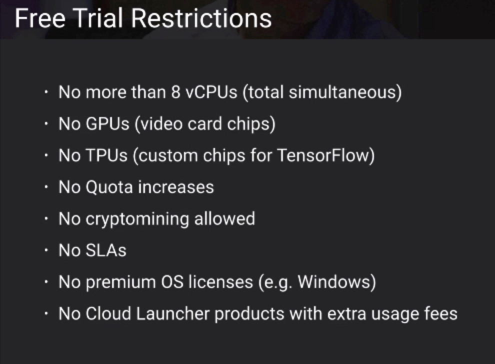
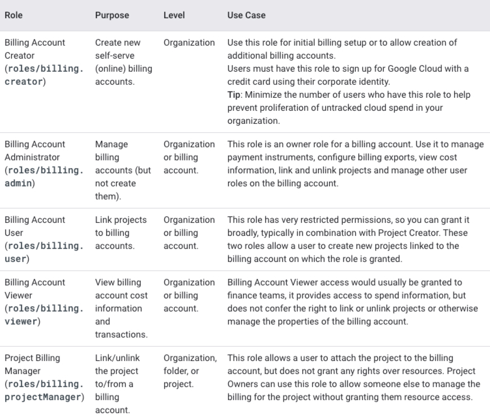

# accounts

The Google Cloud Free Program comprises the following:

- 90-day, $300 Free Trial: New Google Cloud and Google Maps Platform users can take advantage of a 90-day trial period that includes $300 in free Cloud Billing credits to explore and evaluate Google Cloud and Google Maps Platform products and services. You can use these credits toward one or a combination of products.
- Free Tier: All Google Cloud customers can use select Google Cloud products—like Compute Engine, Cloud Storage, and BigQuery—free of charge, within specified monthly usage limits. When you stay within the Free Tier limits, these resources are not charged against your Free Trial credits or to your Cloud Billing account's payment method after your trial ends.

- Google Maps Platform monthly credit: Google Maps Platform features a recurring $200 monthly credit (see Pricing for Maps, Routes, and Places. The monthly credit applies towards each Maps-related Cloud Billing account you create. Learn more about Google Maps Platform Billing Account Credits.

## Billing IAM

## Reference

- https://cloud.google.com/free/docs/gcp-free-tier#always-free-usage-limits