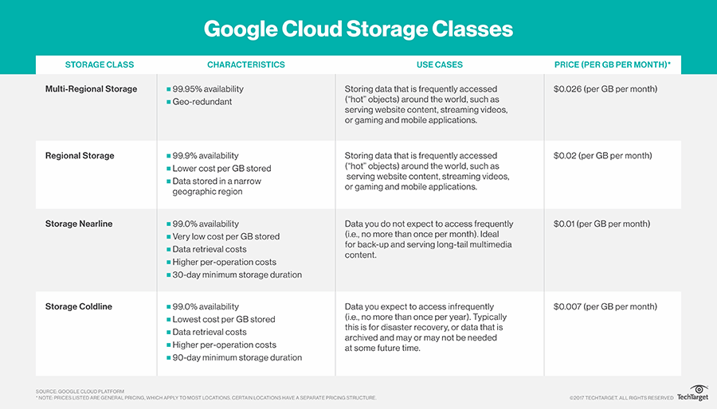
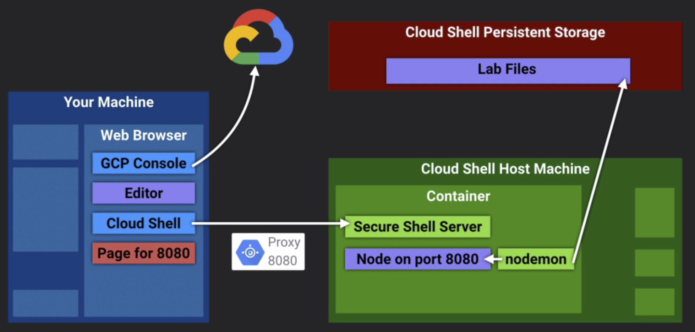

# Basic

## Quotas

- Quotas: 資源上的 Soft Limit

    >Regional and global quotas
    >VM quotas are managed at the regional level. VM instance, instance group, CPU, and Disk quotas can be consumed by any VM in the region, regardless of zone. For example, CPU quota is a regional quota, so there is a different limit and usage count for each region. To launch an e2-standard-16 instance in any zone in the us-central1 region, you need enough quota for at least 16 CPUs in us-central1.

    >Networking and load balancing quotas are required to create firewalls, load balancers, networks, and VPNs. These are global quotas that do not depend on a region. Any region can use a global quota. For example, in-use and static external IP addresses assigned to load balancers and HTTP(S) proxies consume global quotas.

- preemptible: 搶先的資源

    >You can [request](https://cloud.google.com/compute/quotas#requesting_additional_quota) special preemptible quotas for: Preemptible CPUs, Preemptible GPUs, or Preemptible Local SSDs (GB). However, if your project does not have preemptible quota, you can still use the regular quota to launch preemptible resources.

查詢當前Soft limit(quotas)

    gcloud compute  project-info describe --project=black-sanctum-295814

## Cloud Deployment Manager

Templated Deploy Flow

## GCP Markepplace(aka Cloud Launcher)

Buy a Product directly with assemble solution by hands.

## Storage : Nearline and Coldline

## Networking

- Virtual Private Cloud
- Dedicated Interconnect
- Partner Interconnect
- Cloud NAT

## Cloud Shell

下載任何檔案

    dl xxxxx.xx

## DataFlow

Moving, Processing, Remembering

## Reference

- [Compute Engine > Documentation > Resources:Resource quotas](https://cloud.google.com/compute/quotas)